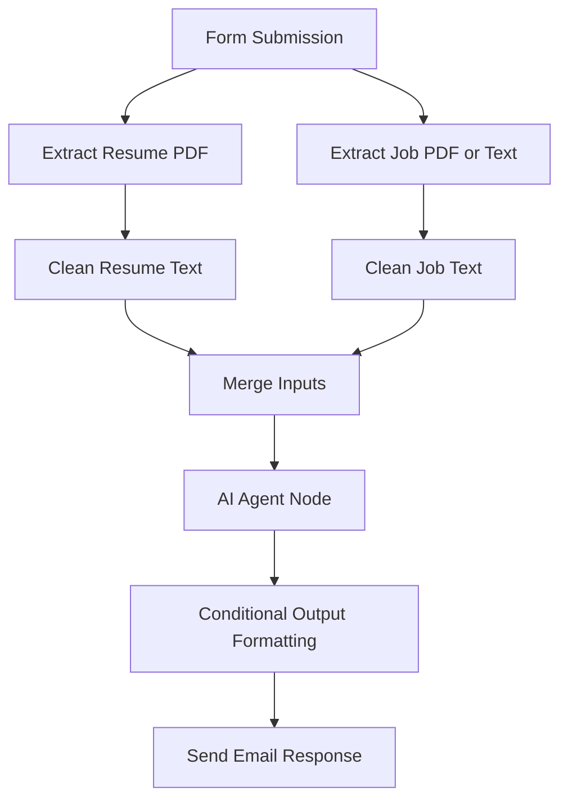

# Resume Tailoring AI Agent (n8n Workflow)

## Overview

This project is a low-code AI-powered resume tailoring workflow built in [n8n](https://n8n.io), designed to parse user-submitted resumes and job descriptions, analyze key requirements, and generate optimized and tailored recommendations for job applicants. Users receive an email with actionable rewrites and enhancements based on AI analysis.

---

## AI Agent Flow Diagram

---

## Building the Agent

### Approach

The goal was to allow users to upload their resume and a job description and automatically receive an optimized set of tailored rewrites. The n8n agent would:

- Parse and sanitize uploaded content
- Format inputs for a schema-compliant AI Agent
- Use structured output parsing to return consistent JSON
- Provide formatted output for markdown, plain text, or HTML

### Key Features

- Form-based input
- PDF and text parsing
- Content cleaning scripts
- Conditional formatting by user preference
- Email delivery of AI-enhanced results

---

## Debugging & Troubleshooting

### Issues Encountered

- **Missing resume_text input**: Despite proper PDF extraction setup, the `resume_text` value was sometimes `null`. This blocked the AI Agent from functioning.
- **Schema validation errors**: Gemini API responses failed due to improper nesting or required fields not being populated.
- **AI token limitations**: The workflow was constrained by API usage limits during testing.

### Troubleshooting Actions

- Implemented truncation and sanitization scripts to ensure resume/job content stayed within token limits and contained clean data.
- Debugged schema alignment against Gemini’s expected structure.
- Verified node-level outputs and introduced default fallbacks using n8n expressions.

---

## Optimization

### Future Improvements

- Switch to a custom wrapper or fallback AI (OpenRouter, Claude, Groq) to reduce token limits or remove reliance on Gemini.
- Add retry logic or fallback paths for failed responses.
- Dynamically extract position titles and keywords with higher accuracy via embeddings.
- Add a UI for previewing resume edits before email delivery.

---

## Screenshots

To include:
- Full n8n agent workflow
- AI Agent node configuration
- Trigger (Form Submission) node
- Sample user input and formatted email output

---

## Status

This is a functioning prototype. Due to token limits and integration issues, final email delivery was not successfully tested, but the pipeline up to the AI Agent node is complete and functional.
